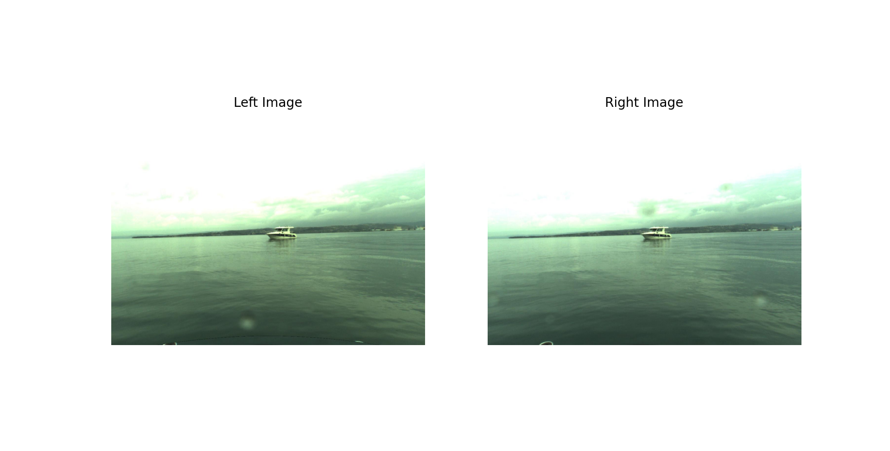
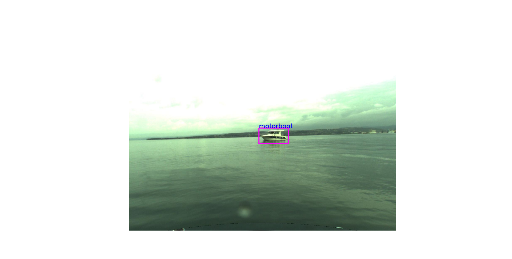
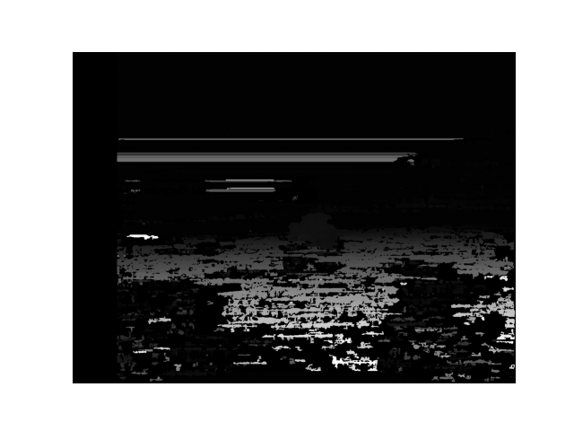
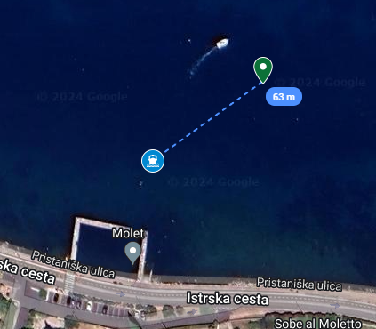

# boat-vision
Computer vision project implemented on a robotic boat with a stereo camera. Detection using YOLOv11, disparity map generation, and georeferencing.





# Requeriments

```bash
pip install -r requeriments.txt
```

# Run the project

```bash
git clone https://github.com/henriqueguanais/boat-vision.git
cd boat-vision
python main.py
```